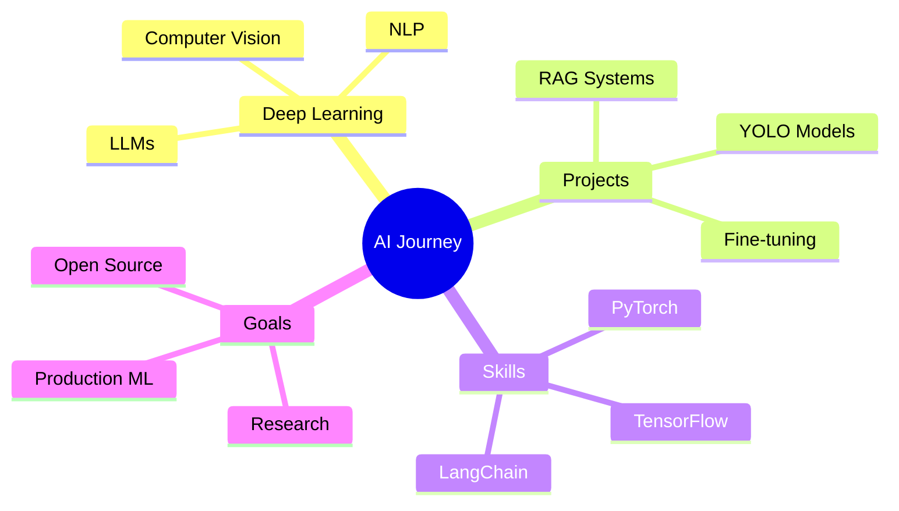

<div align="center">
  
# 👋 Xin chào, mình là [Huyvux]! 

### 🤖 AI/ML Student | 🧠 Deep Learning Enthusiast | 🚀 Tech Explorer

[](https://git.io/typing-svg)

</div>

---

## 🎯 About Me

```python
class AIStudent:
    def __init__(self):
        self.name = "Huyvux"
        self.role = "AI/ML Student"
        self.location = "Vietnam 🇻🇳"
        self.education = "AI/Machine Learning"
        self.interests = [
            "Deep Learning",
            "Computer Vision", 
            "Natural Language Processing",
            "Large Language Models"
        ]
    
    def say_hi(self):
        print("Cảm ơn bạn đã ghé thăm profile của mình!")
        print("Hãy cùng kết nối và học hỏi nhé! 🚀")

me = AIStudent()
me.say_hi()
```

- 🎓 Đang học chuyên ngành **Trí tuệ nhân tạo**
- 🔭 Hiện đang nghiên cứu về **Deep Learning & Computer Vision**
- 🌱 Đang học **PyTorch, TensorFlow, và các LLM frameworks**
- 💡 Đam mê xây dựng các AI applications thực tế
- 🎯 Mục tiêu: Trở thành AI Engineer/Researcher chuyên nghiệp

- 🎓 Đang học chuyên ngành **Trí tuệ nhân tạo**
- 🔭 Hiện đang nghiên cứu về **Deep Learning & Computer Vision**
- 🌱 Đang học **PyTorch, TensorFlow, và các LLM frameworks**
- 💡 Đam mê xây dựng các AI applications thực tế
- 🎯 Mục tiêu: Trở thành AI Engineer/Researcher chuyên nghiệp

---

## 🛠️ Tech Stack

### 💻 Languages


### 🤖 AI/ML Frameworks


### 📚 Libraries & Tools


### ☁️ Cloud & Platforms


---

## 🚀 Featured Projects

<div align="center">

### 🎯 [Project Name 1](link-to-repo)
**Vietnamese Legal Document Retrieval System**
- 🔥 RAG architecture với Qdrant vector database
- 💡 Sử dụng Gemini API & LangChain
- 📊 Fine-tuned embedding models cho legal domain

---

### 🎨 [Project Name 2](link-to-repo)
**YOLO-based Manga Analysis**
- 🖼️ Speech balloon detection & segmentation
- 🚀 Trained on Manga109 dataset
- ⚡ Optimized for real-time inference

---

### 🧠 [Project Name 3](link-to-repo)
**LLM Fine-tuning Project**
- 🎯 Chess move prediction với Qwen2.5-7B
- 🔧 Sử dụng Unsloth framework
- 📈 Training trên GPU H100

</div>

---

## 📊 GitHub Stats

<div align="center">
  


</div>

---

## 🏆 GitHub Trophies

<div align="center">
  
[](https://github.com/ryo-ma/github-profile-trophy)

</div>

---

## 📝 Latest Blog Posts
<!-- BLOG-POST-LIST:START -->
- 🎯 Hướng dẫn fine-tune LLM cho tiếng Việt
- 🔥 RAG architecture cho Vietnamese documents
- 💡 Computer Vision với YOLO: Từ lý thuyết đến thực hành
- 🚀 Tips & tricks khi training models trên Kaggle
<!-- BLOG-POST-LIST:END -->

---

## 🎯 Current Focus



---

## 🤝 Connect With Me

<div align="center">

[]([your-linkedin](https://www.linkedin.com/in/huy-v%C5%A9-730797373/))
[](mailto:vutienhuy.k51a2@gmail.com)
[]([your-facebook](https://www.facebook.com/huy.vu.440145/))
[](Huy-Vũ)

</div>

---

## 💭 Random Dev Quote

<div align="center">
  


</div>

---

## 📈 Activity Graph

[](https://github.com/ashutosh00710/github-readme-activity-graph)

---

<div align="center">

### 💡 "The best way to predict the future is to create it." - Alan Kay

### ⭐️ From [Your Username](https://github.com/YOUR_USERNAME)


</div>

<div align="center">

### 💡 "The best way to predict the future is to create it." - Alan Kay

### ⭐️ From [Your Username](https://github.com/YOUR_USERNAME)


</div>
